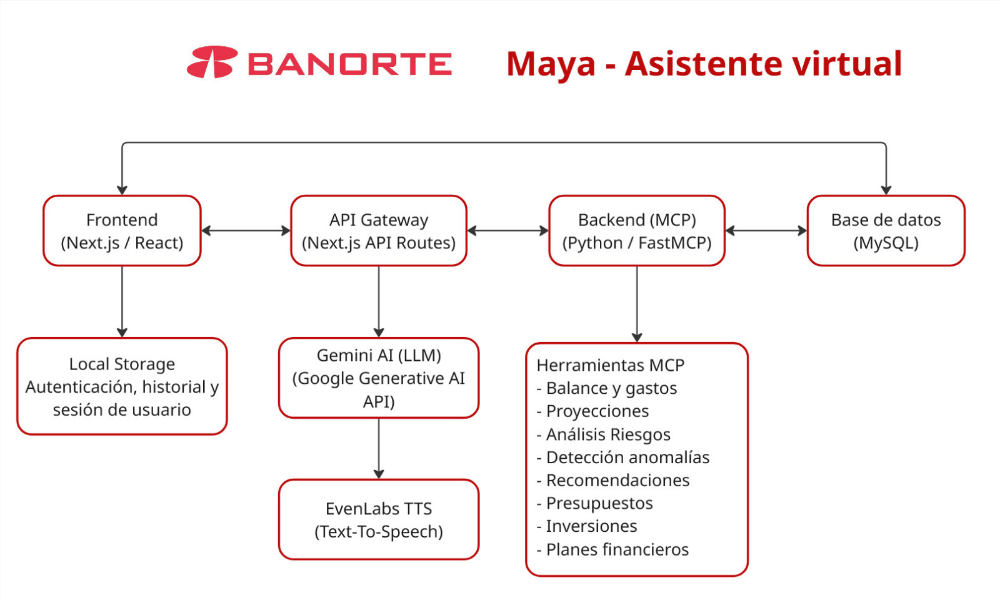

# Maya - Asistente Virtual de Banorte

## HackMTY 2025 - Reto Open Innovation


## Enlaces

*   **Video Demo:** https://youtu.be/wlcTZtYhKEs
*   **Documentación Técnica:** https://docs.banortemaya.tech
*   **Diagrama de Arquitectura:** 


## Concepto de la Solución

Este proyecto presenta una implementación de un **Motor de Cómputo Ponderado (MCP) Financiero**, diseñado para ofrecer a los usuarios de Banorte una herramienta inteligente de análisis y planificación financiera. La solución ingiere datos transaccionales y, a través de un asistente conversacional, permite a los usuarios obtener análisis descriptivos, realizar proyecciones, construir planes financieros y recibir recomendaciones personalizadas.

Nuestro enfoque es un **modelo híbrido**, que combina:
1.  **Herramientas Predefinidas (Deterministas):** Funciones robustas y probadas para cálculos financieros precisos (ej. análisis de gastos, proyecciones de inversión).
2.  **Capacidades Generativas (LLM):** Un Large Language Model (LLM) que actúa como orquestador, interpretando el lenguaje natural del usuario para invocar las herramientas adecuadas y generar narrativas y explicaciones coherentes.

## Tech Stack

El proyecto es un monorepo que se compone de tres subproyectos principales:

| Componente            | Tecnología Principal | Descripción                                                              |
| --------------------- | -------------------- | ------------------------------------------------------------------------ |
| **`backend/`**        | **Python, FastAPI**  | API REST que expone el MCP, orquesta las herramientas y se comunica con la BD. |
| **`frontend/`**       | **Next.js, React**   | Aplicación web interactiva con el asistente y visualizaciones de datos.  |
| **`documentation/`**  | **Astro**            | Sitio de documentación estática con la descripción técnica del proyecto. |

### Tecnologías Clave:
*   **Backend:** Python, FastAPI, SQLAlchemy, Pandas, Pydantic.
*   **Frontend:** TypeScript, Next.js, React, Tailwind CSS, Recharts.
*   **Base de Datos:** MySQL (inferido por el conector).
*   **Documentación:** Astro, Starlight.

## Arquitectura

El monorepo está estructurado para separar las responsabilidades de cada componente:

*   `backend/`: Contiene toda la lógica del servidor.
    *   `main.py`: Punto de entrada de la API FastAPI.
    *   `src/mcp_server.py`: Núcleo del Motor de Cómputo Ponderado.
    *   `src/tools/`: Conjunto de herramientas financieras que el MCP puede invocar.
    *   `src/database/`: Lógica de conexión y consulta a la base de datos.

*   `frontend/`: Contiene la aplicación cliente.
    *   `app/dashboard/asistente/`: Componentes principales de la interfaz de chat.
    *   `app/api/`: Rutas de API de Next.js que actúan como proxy hacia el backend de FastAPI.
    *   `lib/mcp-client.ts`: Cliente para comunicarse con el MCP.

*   `documentation/`: Contiene el sitio de documentación técnica.
    *   `src/content/docs/`: Archivos Markdown que generan las páginas de documentación.

## Instalación y Ejecución Local

Siga estos pasos para levantar el entorno de desarrollo completo.

### Prerrequisitos

*   Node.js (v20 o superior)
*   Python (v3.11 o superior)
*   Una instancia de base de datos MySQL en ejecución.

### 1. Backend (`backend/`)

El backend es el cerebro del sistema, ejecutando el MCP y exponiendo los endpoints.

1.  **Navegar al directorio:**
    ```bash
    cd backend
    ```

2.  **Crear un entorno virtual (recomendado):**
    ```bash
    python -m venv .venv
    source .venv/bin/activate  # En Windows: .venv\Scripts\activate
    ```

3.  **Instalar dependencias:**
    ```bash
    pip install -r requirements.txt
    ```

4.  **Configurar variables de entorno:**
    Cree un archivo `.env` en el directorio `backend/` a partir del archivo `.env.example` (si existe) o créelo desde cero. Debe contener las credenciales de la base de datos:
    ```env
    DB_HOST=localhost
    DB_PORT=3306
    DB_USER=tu_usuario
    DB_PASSWORD=tu_contraseña
    DB_NAME=tu_base_de_datos
    ```

5.  **Ejecutar el servidor:**
    ```bash
    uvicorn main:app --host 0.0.0.0 --port 8000 --reload
    ```
    El servidor estará disponible en `http://localhost:8000`.

### 2. Frontend (`frontend/`)

La interfaz de usuario desde donde se interactúa con el asistente.

1.  **Navegar al directorio:**
    ```bash
    cd frontend
    ```

2.  **Instalar dependencias:**
    ```bash
    npm install
    ```

3.  **Configurar variables de entorno:**
    Cree un archivo `.env.local` en el directorio `frontend/`. Este archivo debe contener la URL del backend.
    ```env
    NEXT_PUBLIC_MCP_API_URL=http://localhost:8000
    ```

4.  **Ejecutar la aplicación:**
    ```bash
    npm run dev
    ```
    La aplicación estará disponible en `http://localhost:3000`.

### 3. Documentación (`documentation/`)

El sitio web con la documentación técnica detallada.

1.  **Navegar al directorio:**
    ```bash
    cd documentation
    ```

2.  **Instalar dependencias:**
    ```bash
    npm install
    ```

3.  **Ejecutar el servidor de desarrollo:**
    ```bash
    npm run dev
    ```
    El sitio de documentación estará disponible en `http://localhost:4321`.